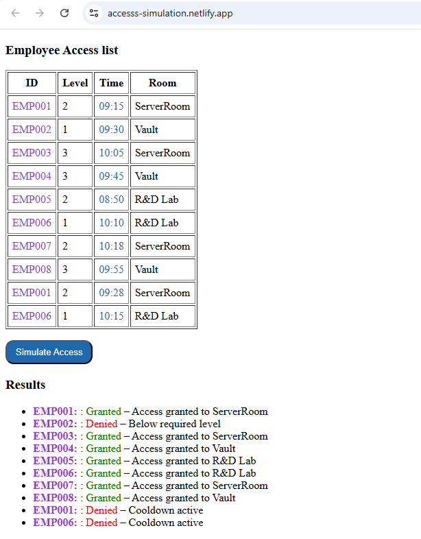

# Access Grid Simulation

---

### 🌐 **Live Demo**
[👉 Open the Website](https://accesss-simulation.netlify.app/)

---

## 📋 Project Overview
This project is a **full-stack web application** that simulates an **access control grid** for employees.  
It allows users to use a sample employee list, then simulate access attempts and view **chronological logs** explaining why each access is granted or denied.

---

## ✨ Features
- **Frontend (Vite + React)**
  - Upload your own employee JSON file or use the default dataset.
  - “Simulate Access” button triggers access checks.
  - Real-time log panel displays each employee’s access result with a detailed reason.
  - Responsive, clean UI.

- **Backend (Node.js + Express + MongoDB)**
  - REST API endpoint to handle access-simulation requests.
  - Uses **MongoDB Atlas** (via Mongoose) to store and retrieve employee data.
  - Environment variables managed securely with `.env`.

---

## 🛠️ Tech Stack
### Frontend
- Vite + React
- HTML5 / CSS3 / JavaScript (ES6+)

### Backend
- Node.js
- Express
- MongoDB & Mongoose
- dotenv for environment variables

Deployment:
- **Frontend:** Netlify  
- **Backend:** Render

---

## ⚙️ Environment Variables
Create a `.env` file in **both** frontend and backend:

### Backend `.env`
-MONGO_URI= "your mongo uri"
-FRONT_URL= "your front url"
-PORT=5000

### Frontend `.env`
-VITE_BACK_URL=https://localhost:5000

**Note:** All frontend variables must start with `VITE_` because of Vite’s environment variable rules.

---

## 🚀 How to Run Locally
1- Clone the Repository

-git clone https://github.com/<your-username>/<repo-name>.git
cd <repo-name>

2- Backend Setup

-cd back
-npm install
-npm run dev
-Server runs on http://localhost:5000

3- Frontend Setup

-cd front
-npm install
-npm run dev
-App runs on http://localhost:5173

---

### How It Works

1- Employee Data
-The app uses a sample JSON dataset of employees or your uploaded file.

2- Access Simulation
-Clicking “Simulate Access” sends a request to the backend.
-The backend checks each employee’s access conditions and returns results.

3- Result Logs
-The frontend displays a chronological list of grant/deny results with reasons.